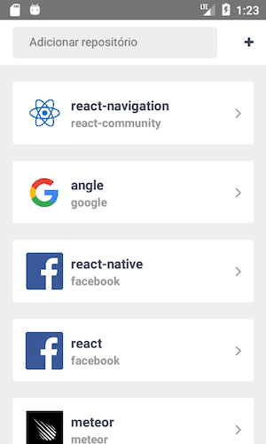
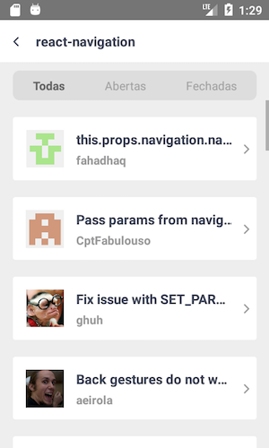

## react-native-sampleapp-github-issues
The application for the user to register repositories and clicking on the repositories, being able to list as questions belonging to the same, in addition it can filter between open, closed or all questions.

### Requirements

- [Node](https://nodejs.org) 4.x or better
- [React Native](http://facebook.github.io/react-native/docs/getting-started.html) for development
- [Xcode](https://developer.apple.com/xcode/) for iOS development (optional)
- [Android SDK](https://developer.android.com/sdk/) for Android development (optional)
- [Android Lollipop](https://www.android.com/versions/lollipop-5-0/) or better for Android device testing (optional)

### Installation

Clone repository:
```sh
git clone git@github.com:cleandersonlobo/react-native-sampleapp-github-issues.git
```
After run:
```sh
npm install
```

## Running

Once dependencies are installed, run the starter kit with:

```sh
npm start or react-native start
```

This will start the React Packager.

### iOS

Open `ios/AwesomeProject.xcodeproj` in Xcode, build and run the project (⌘+R).

### Android

For android development use the following:

```sh
react-native run-android
```
## Usage 

### Add repository
```sh
organzation/repository
```
Then click on the '+'

### Example
```sh
facebook/react-native
```

### Screenshots




## Thanks 

## License

MIT